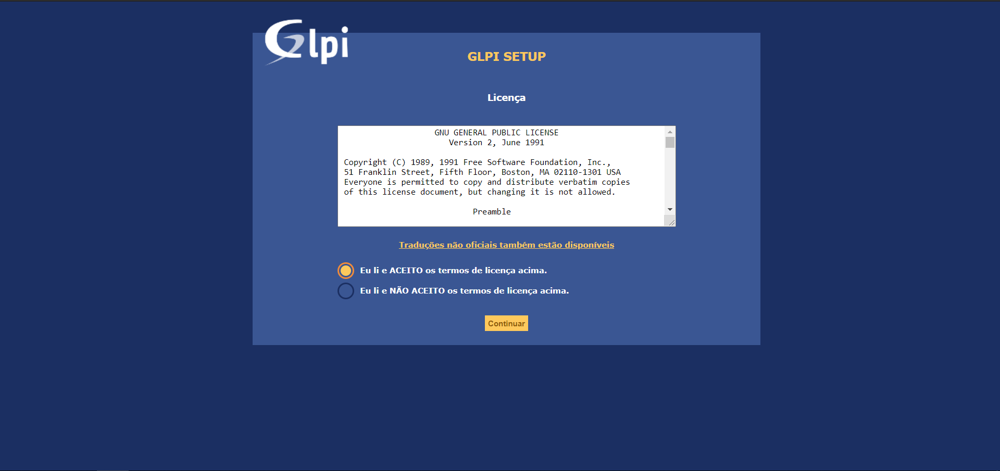
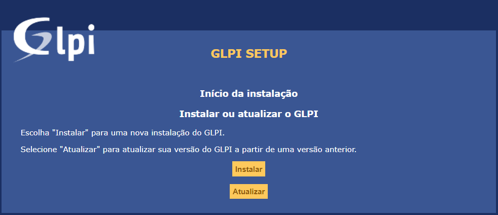
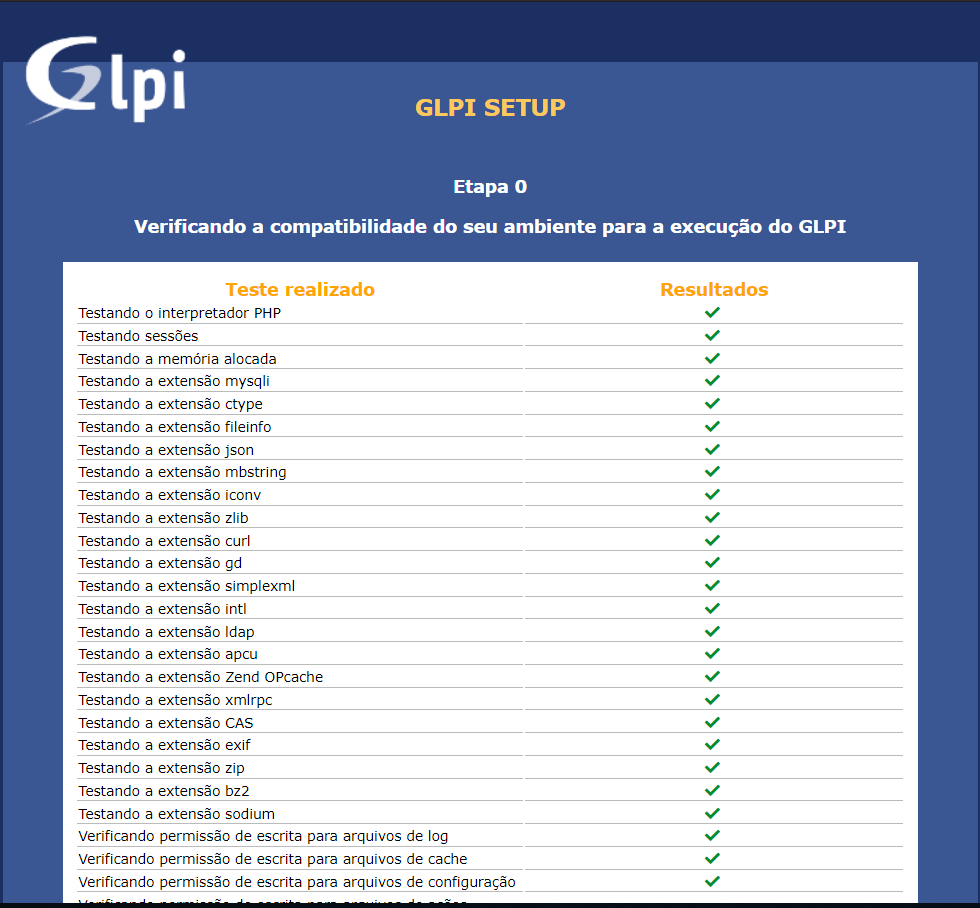
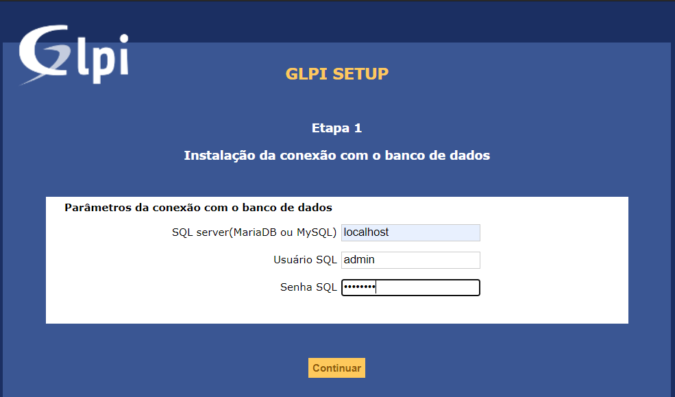
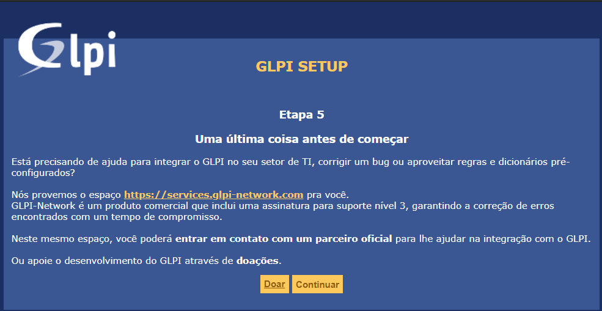
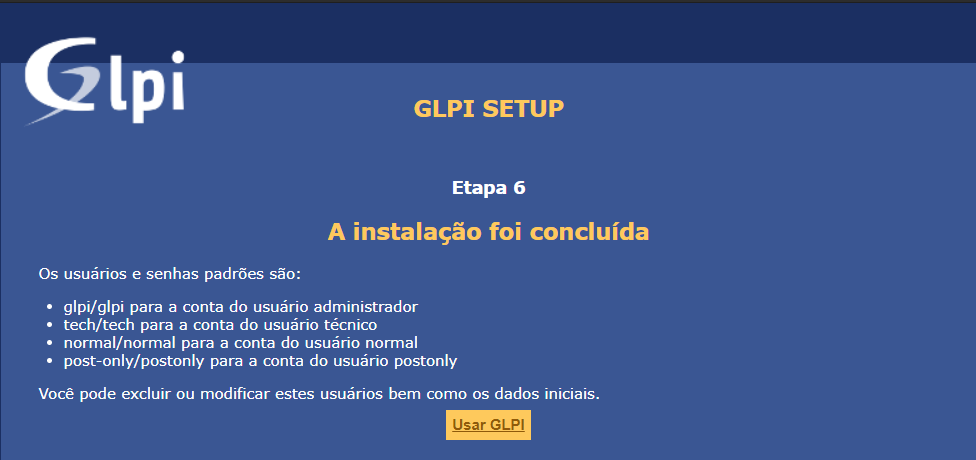
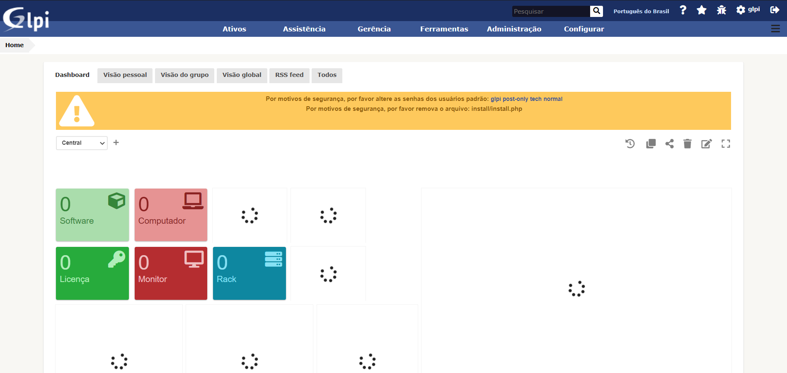

# Instalando GLPI 9.5.5 no Ubuntu Server 20.04.2 LTS

Esse tutorial tem como intuito demonstrar a instalação da ferramenta _Open Source_ **GLPI** para gerenciamento de chamados de suporte em um ambiente de TI. 
* * * 

## Tópicos 

Serão abordados:

* Começando
    * Script .sh para instalação de pré-requisitos necessários para o GLPI.
    * Criação de usuário com privilégio administrativo no banco de dados

* Download e instalação
    * Download e descompactação do sistema GLPI
    * Instalação GLPI

* * *

## Começando

* ### Script .sh para instalação de pré-requisitos necessários para o GLPI

Para executar o script no servidor:

```console 
$ chmod +x script-install-pre-requisitos.sh
$ ./script-install-pre-requisitos.sh
```

O script foi desenvolvido com a ideia de instalar toda a tecnologia necessária para rodar o GLPI. Nele são instalados:

* APACHE

```console
$ sudo apt install -y apache2 apache2-utils
```

* MariaDB

```console
$ sudo apt install -y mariadb-server mariadb-client 
$ sudo mysql_secure_installation 
```

* PHPMyAdmin

```console
$ sudo apt install -y phpmyadmin php7.4-zip
```

* PHP e suas bibliotecas

```console
$ sudo apt install -y php7.4 libapache2-mod-php7.4 php7.4-mysql php-common php7.4-cli php7.4-common php7.4-common php7.4-json php7.4-opcache php7.4-readline php7.4-curl php7.4-gd php7.4-mbstring php-mysqli php-simplexml php7.4-intl php7.4-xml php-cas php7.4-bz2 php7.4-xmlrpc php7.4-ldap php-apcu
```

* Ferramentas adicionais

```console
$ sudo apt install -y zip
$ sudo apt install -y bzip2
```


* ### Criação de usuário com privilégio administrativo no banco de dados

Após o término da execução do script, podemos iniciar algumas configurações importantes, como por exemplo a criação do usuário com privilégios administrativo no banco de dados.

```sql
USE mysql;
CREATE USER '<nome_usuario>'@'localhost' IDENTIFIED BY '<senha_desejada>';
GRANT ALL PRIVILEGES ON *.* TO '<nome_usuario>'@'localhost' WITH GRANT OPTION;
FLUSH PRIVILEGES;
```

## Download e instalação

* ### Download e descompactação do sistema GLPI

Dentro do repositório se encontrará a versão _glpi-9.5.5.tgz_ . Mas essa versão (ou a mais recente) pode ser encontrada em [Download GLPI](https://glpi-project.org/downloads/)

Depois de baixado e transferido o arquivo para o servidor, devemos descompactar e transferir a pasta glpi para a ```/var/www```:

```console 
$ tar -zxvf glpi-9.5.5.tgz
$ sudo mv glpi /var/www/
```

**OBSERVAÇÃO**: em meu ambiente de teste, utilizei do recurso de dar a permissão 777 para o diretório glpi de forma recursiva. Em produção, avalie se essa é uma boa estratégia ou não!

* ### Instalação GLPI

Já pelo navegador, devemos acessar o endereço do seu servidor para iniciar a instalação, exemplo: **localhost/glpi** ou **ip.servidor/glpi**. Você será redirecionado para a seguinte tela:


Ao clicar em '_OK_' , será solicitado que aceite a _GNU GENERAL PUBLIC LICENCE_. Basta aceitar o termo e prosseguir:



O sistema te perguntará se deseja **Instalar** ou **Atualizar**. Nesse caso, escolheremos a opção de instalação:



Caso o _script-install-pre-requisitos.sh_ tenha instalado todos os requisitos sem erro, você verá todos os itens da listagem com o check de ok:



Se você verificar a falha em algum deles, tente encontrar e instalar a biblioteca de forma manual.

Dando continuidade, você será direcionado as etapas de teste de comunicação e configuração com o banco de dados.

Insira o nome do servidor, usuário e senha do usuário com permissão administrativa (mesmo usuário criado acima)



Estando tudo ok, será solicitado para definir o nome do banco de dados que criado e utilizado pelo GLPI.


Após a criação do banco, basta continuar nas telas seguintes até encontrar o botão **_Usar o GLPI_**





Na tela de login, entre com o usuário padrão _glpi_ (senha: glpi) e comece a usar a ferramenta:


